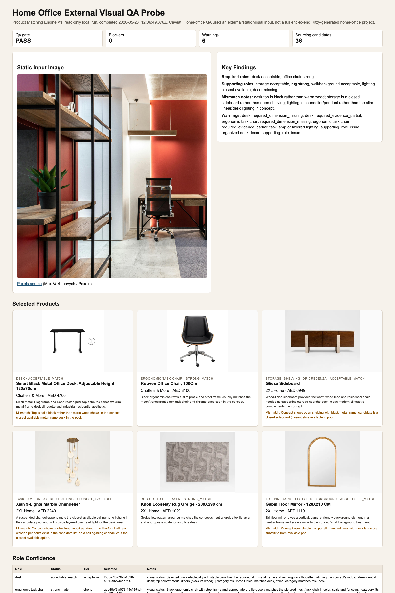

# Product Matching Engine V1 Home Office External Image QA

Runtime impact: none. This is a docs/artifacts-only evidence pass.

## Scope

This report fills the home-office visual QA gap using the Chief Architect approved option 1: one public/static image input, a local read-only catalog probe, and one AI visual arbitration call.

Explicit caveat: home-office QA used an external/static visual input, not a full end-to-end Ritzy-generated home-office project. Treat this as a representative QA probe only, not proof of production readiness.

Hard boundaries honored:

- No seed writes.
- No DB writes.
- No app-action writes.
- No migrations or generated DB types.
- No runtime behavior changes.
- No prompt changes.
- No default-on activation.
- No production flags or live catalog writes.

## Input Image

- Source page: https://www.pexels.com/photo/office-with-shelves-near-table-and-chair-6899394/
- Direct image URL used for QA: https://images.pexels.com/photos/6899394/pexels-photo-6899394.jpeg?cs=srgb&fm=jpg
- Credit: Max Vakhtbovych / Pexels
- License: Pexels free-to-use license

Selection checks:

- No people visible.
- No visible watermark found during local inspection.
- No visible brand label used as an intentional feature.
- Includes desk, office chair, storage/shelving, lighting, wall decor/background, and realistic study styling.

Evidence screenshot:

## Run Details

- Date: 2026-05-23
- Lane: Product Matching Engine
- Environment: local read-only harness against hosted Supabase reads
- Product Matching Engine V1 flag value: `true` in local process only
- Room type: Home Office
- Concept title: External static home-office QA probe
- App action used: no
- DB writes: none
- Raw local harness output: `/tmp/product-matching-home-office-qa-2026-05-23.json` (not committed)
- Catalog rows queried: 1000
- Eligible catalog candidates after filtering: 975
- Sourcing candidates sent to AI: 36
- Role pools supplied: 7
- AI sourcing calls completed: 1

## QA Gate

| Field | Value |
| --- | ---: |
| `passesQaStopRules` | true |
| Blockers | 0 |
| Warnings | 6 |
| Missing required roles | 0 |
| Required closest-available roles | 0 |
| Invalid selections | 0 |
| Required color mismatches | 0 |
| Required missing dimensions | 2 |
| Required partial evidence | 2 |

Warnings:

- Desk: selected product fit could not be fully checked from dimensions.
- Desk: selected product has partial catalog evidence.
- Ergonomic task chair: selected product fit could not be fully checked from dimensions.
- Ergonomic task chair: selected product has partial catalog evidence.
- Task lamp or layered lighting: supporting role needs manual QA review.
- Organized desk decor: supporting role needs manual QA review.

## Selected Products

| Role | Product | Retailer | Status | Confidence | Notes |
| --- | --- | --- | --- | --- | --- |
| Desk | Smart Black Metal Office Desk, Adjustable Height, 120x70cm | Chattels & More | `acceptable_match` | `acceptable` | Slim metal-frame desk matches the concept silhouette; top is black rather than warm wood. |
| Ergonomic task chair | Rouven Office Chair, 100Cm | Chattels & More | `strong_match` | `strong` | Black steel-frame task chair matches the concept chair profile and color. |
| Storage, shelving, or credenza | Gliese Sideboard | 2XL Home | `acceptable_match` | `acceptable` | Warm wood sideboard is plausible supporting storage, but differs from the open shelving in the concept. |
| Task lamp or layered lighting | Xian 9-Lights Marble Chandelier | 2XL Home | `closest_available` | `weak` | Ceiling-hung lighting was the closest available; it does not match the slim linear pendant/task-lighting need. |
| Rug or textile layer | Knoll Looselay Rug Greige - 200X290 cm | 2XL Home | `strong_match` | `strong` | Greige low-pattern rug matches the neutral textile layer. |
| Art, pinboard, or styled background | Gabin Floor Mirror - 120X210 CM | 2XL Home | `acceptable_match` | `acceptable` | Tall mirror provides a vertical background element; concept uses simpler wall treatment. |
| Organized desk decor | none | n/a | `missing_supporting` | `missing` | Supporting decor role was marked missing. |

## Role Pool Observations

| Role | Pool candidates | Pool quality | Notes |
| --- | ---: | --- | --- |
| Desk | 6 | `healthy` | Required role had enough desk candidates and selected a plausible desk. |
| Ergonomic task chair | 6 | `weak` | Required chair role used compatible fallback categories from chairs and armchairs, but the final selected product was a true office chair. |
| Storage, shelving, or credenza | 6 | `healthy` | Storage pool produced a sideboard; open shelving fidelity remains weaker. |
| Task lamp or layered lighting | 6 | `weak` | Pool available, but the selected product was closest-available rather than a strong task/linear lighting match. |
| Rug or textile layer | 6 | `weak` | Final selected rug was visually strong despite weak metadata completeness. |
| Art, pinboard, or styled background | 6 | `healthy` | Final selected mirror is a reasonable substitute from available candidates. |
| Organized desk decor | 6 | `weak` | Model returned this as missing supporting even though the pool had candidates, so prompt/role adherence should be watched. |

## Mismatch Notes

- The desk is a solid black adjustable office desk; the concept desk reads warmer with a wood top and black frame.
- The storage selection is closed sideboard storage rather than the open shelving visible in the concept image.
- The lighting selection is a chandelier/pendant closest-available option, not the concept's slim linear fixture or desk/task lamp.
- The wall/background selection is a tall floor mirror substitute; the concept relies more on wall treatment and shelving.
- The decor role was missing as a supporting role, despite the role pool having candidates.

## Comparison Against Previous Random-Feeling Sourcing

This probe is directionally better than the old static fallback behavior:

- Required role choices stayed role-scoped: desk selected a desk, chair selected an office chair, and storage selected a storage unit.
- No globally valid product was accepted for the wrong role.
- Required desk and chair roles passed the QA stop rules with no blockers.

The remaining issues are precision issues, not broad category drift: lighting is closest-available, storage does not match open shelving closely, and supporting desk decor was marked missing.

## Decision

- QA outcome: representative home-office probe passes the default-off QA gate with warnings.
- Production rollout allowed by this report: no.
- Controlled default-off preview readiness: still needs targeted follow-up before broader preview because this was not a full Ritzy-generated home-office project.
- Recommended next step: address Product Matching Engine V1 preview readiness only after reviewing the accumulated manual QA evidence, especially supporting-role adherence for lighting/decor and richer catalog evidence for office products.
