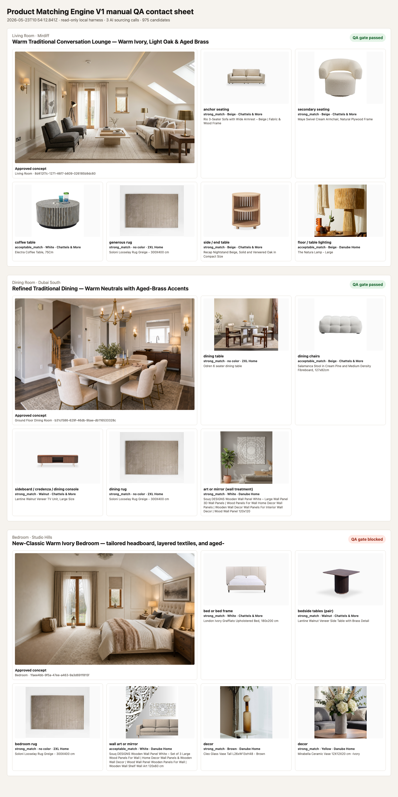

# Product Matching Engine V1 Post-PR103 Validation Evidence

Runtime impact: none. This is a docs/artifacts-only validation note.

## Scope

This pass validates the accumulated Product Matching Engine V1 evidence after PR #103, which fixed bedside/side-table role category normalization in the default-off confidence metadata path.

No new runtime behavior is changed by this document.

Superseded follow-up: `2026-05-23-post-105-validation-evidence.md` records that PR #105 clears the retained bedroom bedside-table role-result blocker under deterministic replay. This post-PR103 note remains useful as the historical stop-rule finding that led to PR #105, but it is no longer the latest blocker status.

Hard boundaries honored:

- No default-on activation.
- No production flags.
- No deploys.
- No live writes, catalog writes, shopping-list writes, or app-action writes.
- No DB/schema changes.
- No UI changes.
- No prompt changes.
- No Catalog-First runtime coupling.
- No production rollout decision.

## Run Details

- Date: 2026-05-23
- Lane: Product Matching Engine
- Branch: `codex/product-match-post-103-validation`
- Base `main`: `f61b4e2027762c023a14663649936cefbec42db5`
- Product Matching Engine V1 flag: evaluated only as default-off/local QA metadata
- App action used: no
- DB writes: none
- Catalog writes: none
- Shopping-list writes: none
- Fresh hosted reads or AI calls in this pass: no
- Source artifacts reviewed:
  - `manual-qa/2026-05-23-product-matching-engine-v1-evidence.md`
  - `manual-qa/2026-05-23-home-office-external-image-qa.md`
  - retained local raw QA outputs under `/tmp` were inspected but are not committed because they include expiring signed concept image URLs

The current shell does not have OpenAI or Supabase environment variables loaded, so this pass did not make a fresh AI sourcing call. Instead, it revalidated the previous manual QA findings against the current post-PR103 normalization behavior and stop rules. Treat this as a blocker-focused validation probe, not a full new end-to-end QA run.

## Existing Visual Evidence

Previously committed safe contact sheets remain the visual evidence for the covered scenarios:

## Coverage

| Room type | Evidence source | Validation status | Notes |
| --- | --- | --- | --- |
| Living room | Prior local read-only visual QA | Still directionally passed | Beige/cream sofa regression stayed clear; warnings remain around missing measurements/evidence and supporting roles. |
| Dining room | Prior local read-only visual QA | Still directionally passed | Dining chairs did not select bulky armchairs; sideboard/storage remains a supporting-role review item. |
| Bedroom | Prior local read-only visual QA plus post-PR103 normalization probe | Still blocked | PR #103 fixes category identity for `bedside tables`, but the retained role result still has `status=missing_required` and `productId=null`. |
| Home office/study | Prior external/static-image QA | Still representative-only pass with warnings | Required desk/chair roles passed; lighting/decor supporting roles remain weak. This is not a full Ritzy-generated home-office project. |

## Post-PR103 Bedroom Probe

The prior bedroom blocker had two separable parts:

1. Category identity was wrong in metadata because bedroom-adjacent labels such as `bedside tables`, `bedside lighting`, and `bedroom rug` were re-normalized through the generic `bed` text match.
2. The required bedside-table role was still not satisfied because the role result reported the role as missing with no product id, even though `selectedProducts` contained a plausible side table.

PR #103 addresses part 1. A post-PR103 normalization probe shows:

| Role label | Prior emitted category | Post-PR103 normalized category | Status | Product id |
| --- | --- | --- | --- | --- |
| Bed or bed frame | `beds` | `beds` | `strong_match` | `ed6e9ad5-1ece-401d-b02b-34343340fc1e` |
| Bedroom rug | `beds` | `rugs` | `strong_match` | `c3fb4a11-4113-41be-9753-e5e8befc6679` |
| Bedside tables | `beds` | `side_tables` | `missing_required` | none |
| Bedside lighting | `beds` | `lighting` | `missing_supporting` | none |

The prior required-role blocker is therefore not cleared by PR #103 alone. The category is now correct, but the bedside role remains missing because the role result itself did not carry the selected side-table product id.

## Prior Blocker Comparison

| Prior blocker | Post-PR103 status | Interpretation |
| --- | --- | --- |
| `side_tables` / bedside table category collapsed to `beds` | Fixed for normalization identity | The default-off metadata path now preserves `side_tables` and non-bed bedroom-adjacent roles. |
| Bedroom required bedside-table role failed the QA gate | Still blocked in retained evidence | The selected-product list had a plausible side table, but role confidence depends on valid role results, and the role result remains `missing_required`. |
| `bedside lighting` and `bedroom rug` collapsed into `beds` | Fixed for category identity | These no longer look like bed roles after PR #103 normalization. |
| Home-office coverage missing | Partially addressed by static-image probe | Still not a full Ritzy-generated home-office project. |
| Supporting role adherence weak for lighting/decor/storage | Still open | Home office lighting/decor and living/dining storage/supporting roles still need manual review. |

## Stop Rule Result

This validation pass triggers the Chief Architect stop rule.

Reason: the previous bedroom bedside-table blocker is not fully cleared by the merged normalization fix. The remaining issue appears to be role-result contract adherence: selected products can include a plausible required product while `roleResults` still marks that exact required role missing.

Do not quietly fix this in the evidence PR. The next implementation scope should be explicitly approved before changing prompts, AI validation, app-action wiring, or runtime behavior.

## Recommended Next Scoped PR

Recommended next Product Matching PR: prompt-only role-contract hardening for visual sourcing role results, or a narrowly approved AI validation contract fix if the architect wants runtime handling.

The smallest prompt-only option would instruct the model to copy each supplied role pool's `category` and `roleLabel` exactly into `roleResults`, and to ensure any selected required product has a matching role result with the same product id. That option would not change runtime behavior by itself.

If the architect prefers a runtime contract fix, approve it separately and keep it default-off with tests. Do not combine it with this evidence PR.

## Decision

- QA outcome: blocked for controlled default-off preview testing.
- Bedroom bedside-table blocker cleared: no.
- Product Matching Engine V1 production rollout allowed: no.
- Controlled default-off preview activation approved by this document: no.
- Next action needed: Chief Architect decision on the next scoped fix.
